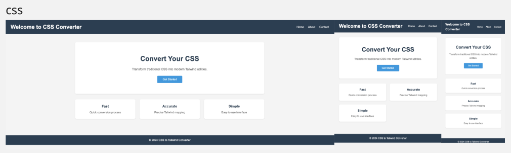
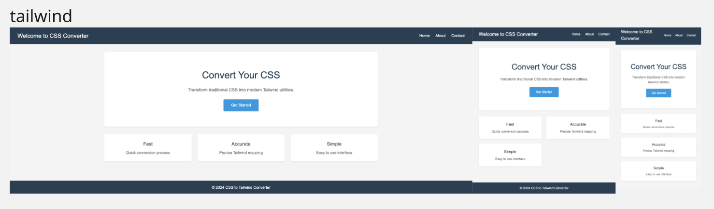

# CSS to Tailwind Converter

A powerful automated tool that converts traditional CSS stylesheets to Tailwind CSS utility classes, preserving responsive design across all breakpoints.

## Overview

This converter analyzes your HTML and CSS files using Playwright and Chrome DevTools Protocol (CDP) to accurately extract applied styles at different viewport sizes, then translates them into equivalent Tailwind CSS utility classes. The tool maintains perfect fidelity to your original styles while transitioning to the utility-first Tailwind approach.

> **⚠️ Alpha Version Notice**  
> This is still in development stage and requires more testing. There are many areas that need improvement.

## Showcase

### Before (CSS)


### After (Tailwind)


## Features

- **Accurate Style Extraction**: Uses real browser rendering to capture exactly which styles apply to each element
- **Responsive Design Support**: Automatically handles all Tailwind breakpoints (sm, md, lg, xl, 2xl)
- **Preserves Original Values**: Maintains authored CSS values (e.g., `10vw`, `calc()`) not just computed pixels
- **Complete Coverage**: Expands all CSS shorthand properties for thorough conversion
- **Media Query Validation**: Ensures compatibility with Tailwind's breakpoint system
- **Detailed Logging**: Comprehensive debug logs for troubleshooting

## Prerequisites

- Node.js (v14 or higher)
- npm or yarn
- Chrome/Chromium browser (automatically installed by Playwright)

## Installation

1. Clone the repository:
```bash
git clone https://github.com/airman5573/css-to-tailwind-converter.git
cd css-to-tailwind-converter
```

2. Install dependencies:
```bash
npm install
```

## Project Structure

```
css-to-tailwind-converter/
├── converter.js           # Main converter script
├── package.json          # Project dependencies
├── test/                 # Test files
│   ├── input/           # Source files
│   │   ├── index.html   # Input HTML
│   │   └── style.css    # Input CSS
│   └── output/          # Generated files
│       ├── tailwind.html         # Final HTML with Tailwind classes
│       ├── html-with-ids.html   # HTML with element IDs added
│       └── json/                # Intermediate processing files
├── logs/                # Debug logs
├── tools/               # Documentation for tools used
└── manual/              # CDP and Playwright documentation
```

## Usage

1. Place your HTML and CSS files in the `test/input/` directory:
   - `index.html` - Your HTML file
   - `style.css` - Your CSS stylesheet

2. Run the converter:
```bash
npm run convert
```

3. Find the converted HTML at `test/output/tailwind.html`

## How It Works

### Phase 0: Media Query Validation
Verifies that all media queries match Tailwind's breakpoint system

### Phase 1: CSS Pre-processing
1. Adds unique `data-element-id` attributes to all HTML elements
2. Consolidates and cleans CSS rules using `clean-css`
3. Expands all shorthand properties for consistent processing

### Phase 2: Style Extraction
For each breakpoint (default, sm, md, lg, xl, 2xl):
1. Captures styles with CSS disabled (baseline)
2. Captures styles with CSS enabled
3. Identifies changed properties
4. Extracts original authored CSS values using CDP

### Phase 3: Conversion
1. Translates CSS properties to Tailwind utility classes
2. Applies responsive prefixes for breakpoint-specific styles
3. Generates final HTML with all Tailwind classes applied

## Breakpoint Configuration

| Breakpoint | Prefix | Minimum Width | Viewport Size (Test) |
|------------|--------|---------------|---------------------|
| Default    | -      | -             | 375×667px          |
| Small      | sm:    | 640px         | 640×768px          |
| Medium     | md:    | 768px         | 768×1024px         |
| Large      | lg:    | 1024px        | 1024×768px         |
| Extra Large| xl:    | 1280px        | 1280×800px         |
| 2X Large   | 2xl:   | 1536px        | 1536×864px         |

## Generated Files

The converter creates several intermediate files for debugging and analysis:

- `html-with-ids.html` - HTML with element IDs added
- `processed.css` - Cleaned and expanded CSS
- `[breakpoint]-css-disabled.json` - Baseline styles
- `[breakpoint]-css-enabled.json` - Styles with CSS applied
- `[breakpoint]-changed-css-property.json` - Properties modified by CSS
- `[breakpoint]-matched-css-rule.json` - Original CSS values
- `[breakpoint]-tailwind-class.json` - Converted Tailwind classes

## Limitations

- Only supports Tailwind's standard breakpoints
- Custom CSS properties may not have direct Tailwind equivalents
- Complex selectors (`:nth-child`, `:hover`) require manual adjustment
- Animations and transitions need manual conversion

## Troubleshooting

1. **Check logs**: Debug logs are saved in the `logs/` directory with timestamps
2. **Verify media queries**: Ensure your CSS uses Tailwind-compatible breakpoints
3. **Element count**: Large HTML files may take longer to process
4. **CSS specificity**: Complex cascade rules may need manual review

## Contributing

Contributions are welcome! Please feel free to submit a Pull Request.

## License

This project is licensed under the MIT License - see the LICENSE file for details.

## Acknowledgments

- [Playwright](https://playwright.dev/) for browser automation
- [clean-css](https://github.com/clean-css/clean-css) for CSS optimization
- [Tailwind CSS](https://tailwindcss.com/) for the utility-first CSS framework

## Support

For issues, questions, or suggestions, please open an issue on GitHub.